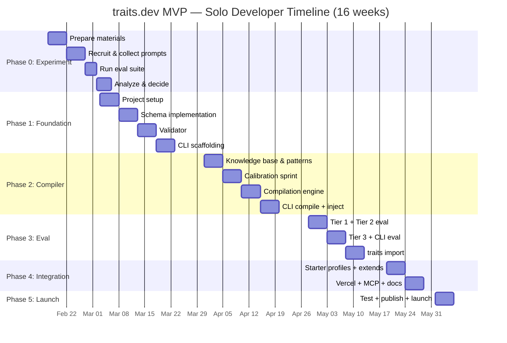

# traits.dev MVP Implementation Plan

## Solo Developer Build — From Architecture to Shipping Code

*February 2026 — This plan translates the architectural specifications from Parts III and IV into a realistic solo-developer implementation sequence. It resolves the gaps identified during the architecture review, expands the schema to v1.4, and scopes the MVP to what one person can ship in ~16 weeks without cutting corners on the product's core value claims.*

> **Status (2026-02-13):** Implementation source of truth. This plan formally supersedes:
> - `docs/planning/traits-dev-architectural-decisions-part4.md` for MVP schema authority (v1.3 -> v1.4)
> - `docs/planning/traits-dev-mvp-development-plan.md` for MVP execution sequencing and scope

---

## What Changed from the Existing MVP Plan

The existing `traits-dev-mvp-development-plan.md` was written for a team. This plan makes the following adjustments:

| Aspect | Original Plan | This Plan |
|---|---|---|
| **Timeline** | 12 weeks (team) | 16 weeks (solo) |
| **Schema version** | v1.3 (5 dimensions) | v1.4 (6 dimensions — adds `humor`) |
| **Profile names** | advisor, guide, catalyst | steward, haven, pipeline (branded names from library) |
| **Composition operators** | extends + compose + merge (Week 12) | extends only (compose/merge deferred) |
| **Billing infrastructure** | Week 12 | Deferred — launch free, add billing post-MVP |
| **Website** | Full landing page + docs (Week 12) | Docs site only (VitePress) |
| **CLI commands** | 8 commands | 5 core commands (init, validate, compile, eval, import); suggest/migrate/diff deferred |
| **API key strategy** | Unaddressed | Developer-supplied keys; core loop offline-capable |
| **MCP server** | Week 12 | Simplified Phase 1 (Week 15) |
| **Vercel middleware** | Week 12 | Week 15 (simplified) |

### What's Deferred to Post-MVP

- `traits suggest` command
- `traits migrate` command
- `traits diff` command
- `compose` and `merge` composition operators
- Billing/payment infrastructure
- Marketing website (beyond docs)
- Analytics dashboard
- Python SDK
- Runtime drift detection middleware
- Adaptive compilation (compiler treats adaptive profiles as non-adaptive in v1)

---

## Key Architectural Decisions (Gap Resolutions)

### Decision 1: Schema v1.4 — Adding `humor` as 6th Dimension

**Problem**: The personality profiles library uses 8+ dimensions. The v1.3 schema has 5. The profiles consistently need `humor` and `humor_style` — these cannot be adequately expressed as behavioral rules without inflating constraint count.

**Decision**: Add `humor` as a 6th dimension with an optional `style` qualifier.

```yaml
# v1.4 schema: humor dimension
voice:
  # Shorthand
  humor: "low"

  # Object syntax (adaptive)
  humor:
    target: "low"
    style: "dry"          # none | dry | subtle-wit | playful
    adapt: true
    floor: "very-low"
    ceiling: "medium"
```

**Calibration cost impact**: +5 base patterns per model (10 total), +3-4 interaction patterns (humor x warmth, humor x formality). Total calibration points: ~215-220 vs. ~200. Manageable.

**Not adding**: `enthusiasm` (approximated by warmth + humor + behavioral rules), `emoji_usage` (becomes vocabulary constraint), `tone` (derived label, not a dimension), `response_length` (becomes behavioral rule).

### Decision 2: Profile Naming — Use Library Names

**Problem**: Part IV names the 5 MVP profiles as `resolve`, `architect`, `advisor`, `guide`, `catalyst`. The profile library uses different, more evocative names. `catalyst` collides — it's "Creative Collaboration" in the library but "Sales" in Part IV.

**Decision**: Use the profile library's branded names, which follow the "single-word evoking the role" philosophy:

| Part IV Name | Library Name | Vertical |
|---|---|---|
| resolve | **resolve** | Customer support |
| architect | **architect** | Developer experience |
| advisor | **steward** | Financial advisory |
| guide | **haven** | Healthcare companion |
| catalyst | **pipeline** | Consultative sales |

This reserves `catalyst` for the Creative Collaboration profile (library #14), which ships post-MVP.

### Decision 3: API Key Strategy — Developer-Supplied, Core Loop Offline

**Problem**: Eval Tier 2-3 and `traits import` require LLM API calls. No authentication strategy was defined.

**Decision**: Developers supply their own API keys via environment variables. The core authoring loop requires zero API calls.

| Feature | API Keys Required | Env Variable |
|---|---|---|
| `traits init` | None | — |
| `traits validate` | None | — |
| `traits compile` | None | — |
| `traits compile --explain` | None | — |
| `traits eval --tier 1` | None | — |
| `traits eval --tier 2` | Embedding API | `TRAITS_OPENAI_API_KEY` |
| `traits eval --tier 3` | LLM API | `TRAITS_OPENAI_API_KEY` or `TRAITS_ANTHROPIC_API_KEY` |
| `traits import` | LLM API | `TRAITS_OPENAI_API_KEY` or `TRAITS_ANTHROPIC_API_KEY` |

**DX implication**: A developer can `npm install @traits-dev/cli`, create a profile, validate it, and compile it for any model — all without API keys, API calls, or an internet connection. This is the zero-friction onboarding story.

### Decision 4: Outcome C Contingency — Scoped Pivot

**Problem**: If the validation experiment shows the compiler underperforms experts (Outcome C), the product needs to pivot. The existing plan's description of this pivot is vague.

**Decision**: If Outcome C occurs, the MVP scope pivots to:

- **Primary workflow**: `traits import` (analyze existing prompt) → `traits eval` (score it) → manual refinement → `traits eval` (re-score)
- **Compiler becomes**: A "best-practice applier" that takes a developer's prompt and suggests structured improvements rather than generating from scratch
- **Knowledge base becomes**: A set of scoring rubrics and improvement suggestions rather than generation patterns
- **The schema, validator, and eval framework ship unchanged** — they're valuable regardless

The Phase 1 Foundation work (Weeks 4-6) is immune to this pivot. The experiment must complete before Week 7 (compiler development begins).

### Decision 5: State Across Turns — Out of Scope, Documented

**Problem**: Adaptive profiles define how personality should shift, but compilation is stateless (happens once before the conversation). There's no mechanism for the personality to remember its adapted state across turns.

**Decision**: Explicitly out of scope for MVP. The adaptive schema is accepted and validated but not compiled. The runtime drift detection middleware (Team tier, post-MVP) is where turn-aware adaptation belongs. Document this limitation clearly.

---

## Tech Stack

| Component | Choice | Rationale |
|---|---|---|
| **Package manager** | pnpm | Fastest, native workspace support, disk-efficient |
| **Build orchestration** | Turborepo | Intelligent caching, minimal config, pnpm-native |
| **Bundler** | tsup | Zero-config, dual ESM/CJS, .d.ts generation, esbuild-powered |
| **CLI framework** | Commander.js | Battle-tested, lightweight, full control |
| **YAML parsing** | `yaml` (npm) | Modern, YAML 1.2 compliant, native TypeScript, actively maintained |
| **Test framework** | Vitest | Fast, native ESM, monorepo `projects` config |
| **Embeddings (Tier 2 eval)** | OpenAI text-embedding-3-small | Cheapest quality embedding, widely available |
| **LLM judge (Tier 3 eval)** | Configurable (Claude/GPT) | Developer's choice via their API key |
| **Documentation** | VitePress | Simple, fast, Markdown-native, good for SDK docs |
| **Versioning/Publishing** | Changesets | Monorepo publishing standard, automated changelogs |
| **CI** | GitHub Actions | Standard, free for open source |

---

## Monorepo Structure

```
traits-dev/
├── packages/
│   ├── core/                    # @traits-dev/core
│   │   ├── src/
│   │   │   ├── schema/
│   │   │   │   ├── types.ts           # Core schema types (v1.4)
│   │   │   │   ├── parser.ts          # YAML parsing + normalization
│   │   │   │   ├── normalizer.ts      # Shorthand → object syntax
│   │   │   │   └── index.ts
│   │   │   ├── validator/
│   │   │   │   ├── engine.ts          # Core validation pipeline
│   │   │   │   ├── safety.ts          # S001-S004 safety checks
│   │   │   │   ├── overspec.ts        # Overspecification guards
│   │   │   │   ├── extremes.ts        # Extremes envelope analysis
│   │   │   │   └── index.ts
│   │   │   ├── compiler/
│   │   │   │   ├── engine.ts          # Compilation pipeline
│   │   │   │   ├── patterns.ts        # Pattern selection logic
│   │   │   │   ├── interactions.ts    # Interaction effect handling
│   │   │   │   ├── safety-floor.ts    # Safety floor injection
│   │   │   │   ├── placement.ts       # Model-specific placement
│   │   │   │   ├── trace.ts           # --explain compilation trace
│   │   │   │   └── index.ts
│   │   │   ├── eval/
│   │   │   │   ├── runner.ts          # Eval orchestration
│   │   │   │   ├── tier1.ts           # Deterministic checks
│   │   │   │   ├── tier2.ts           # Embedding-based checks
│   │   │   │   ├── tier3.ts           # LLM judge checks
│   │   │   │   ├── baselines.ts       # Baseline generation
│   │   │   │   ├── report.ts          # Report formatting
│   │   │   │   └── index.ts
│   │   │   ├── inject/
│   │   │   │   ├── inject.ts          # injectPersonality helper
│   │   │   │   ├── detect-sections.ts # System prompt section detection
│   │   │   │   └── index.ts
│   │   │   └── index.ts              # Public API exports
│   │   ├── tsup.config.ts
│   │   ├── vitest.config.ts
│   │   └── package.json
│   ├── cli/                     # @traits-dev/cli
│   │   ├── src/
│   │   │   ├── commands/
│   │   │   │   ├── init.ts
│   │   │   │   ├── validate.ts
│   │   │   │   ├── compile.ts
│   │   │   │   ├── eval.ts
│   │   │   │   └── import.ts
│   │   │   └── index.ts
│   │   ├── tsup.config.ts
│   │   └── package.json
│   ├── vercel/                  # @traits-dev/vercel
│   │   ├── src/
│   │   │   ├── middleware.ts    # withPersonality wrapper
│   │   │   └── index.ts
│   │   └── package.json
│   └── mcp/                     # @traits-dev/mcp
│       ├── src/
│       │   ├── server.ts        # MCP resource server
│       │   └── index.ts
│       ├── artifacts/           # Pre-compiled profile artifacts
│       └── package.json
├── profiles/                    # Starter profile library (v1.4 YAML)
│   ├── resolve.yaml
│   ├── architect.yaml
│   ├── steward.yaml
│   ├── haven.yaml
│   └── pipeline.yaml
├── knowledge-base/              # Calibrated patterns
│   ├── claude/
│   │   ├── formality/           # 5 level patterns
│   │   ├── warmth/
│   │   ├── verbosity/
│   │   ├── directness/
│   │   ├── empathy/
│   │   ├── humor/
│   │   └── interactions/        # Interaction effect patterns
│   └── gpt/
│       └── ...                  # Same structure
├── eval-scenarios/              # Eval scenario library
│   ├── general/                 # Domain-agnostic scenarios
│   ├── customer-support/        # resolve-specific
│   ├── developer/               # architect-specific
│   ├── financial/               # steward-specific
│   ├── healthcare/              # haven-specific
│   └── sales/                   # pipeline-specific
├── experiment/                  # Validation experiment materials
│   ├── brief.md
│   ├── scenarios/
│   ├── prompts/                 # Collected participant prompts
│   ├── results/
│   └── analysis.md
├── docs/                        # VitePress documentation site
├── .github/
│   └── workflows/
│       ├── ci.yml
│       └── release.yml
├── pnpm-workspace.yaml
├── turbo.json
├── tsconfig.base.json
├── vitest.config.ts             # Root config with projects
└── package.json
```

---

## Phase 0: Validation Experiment (Weeks 1–3)

*The experiment runs before compiler development begins. It determines whether the compiler optimizes for quality, workflow, or assisted refinement. Schema, validator, and CLI scaffolding begin in parallel during Week 3.*

### Week 1: Prepare Materials

**Tasks:**

- [ ] Author 3 test profiles in v1.4 schema: `resolve`, `architect`, `steward`
  - Files: `experiment/profiles/resolve.yaml`, `experiment/profiles/architect.yaml`, `experiment/profiles/steward.yaml`
  - These become the drafts for the final starter profiles

- [ ] Hand-compile each profile into the system prompt the compiler would produce
  - For each profile, write the optimized system prompt using the patterns described in Parts I and III
  - Target model: Claude Sonnet 4.5 (primary), GPT-4o (secondary)
  - Files: `experiment/compiled/resolve-claude.txt`, `experiment/compiled/resolve-gpt.txt`, etc.

- [ ] Write the 50-scenario eval suite
  - 15 standard domain-appropriate requests
  - 10 frustrated/adversarial user scenarios
  - 5 edge cases (rule-breaking, ambiguous)
  - 5 multi-turn conversations (10+ turns each)
  - 5 formal register scenarios
  - 5 casual register scenarios
  - 5 mixed register scenarios (shift mid-conversation)
  - File: `experiment/scenarios/eval-suite.json`

- [ ] Build eval harness script
  - Script that runs each prompt x each scenario through the target model
  - Collects responses in structured format
  - File: `experiment/scripts/run-eval.ts`

- [ ] Define scoring rubrics for each metric
  - Vocabulary adherence, response structure, formality consistency, warmth/empathy, humor appropriateness, directness, task helpfulness, multi-turn consistency
  - File: `experiment/rubrics.md`

### Week 2: Recruit, Collect, Evaluate

**Tasks:**

- [ ] Recruit Cohort A (5-8 typical developers)
  - Source: dev communities (Reddit r/programming, Discord servers, X/Twitter), personal network
  - Criteria: has written at least one system prompt, not a prompt engineering specialist
  - Provide brief async (Google Form or similar) — 20 minute time limit
  - Compensation: optional ($25 gift card or credit toward future Pro subscription)
  - **Solo dev adjustment**: Reduced from 10 to 5-8 participants. Statistical power is lower but sufficient for directional signal.

- [ ] Recruit Cohort B (3-5 experienced prompt engineers)
  - Source: AI/ML communities, prompt engineering focused communities
  - Criteria: 10+ production system prompts
  - 30 minute time limit
  - **Solo dev adjustment**: Reduced from 5 to 3-5.

- [ ] Distribute brief (Part IV Section 1 format) and collect prompts
  - All prompts stored in `experiment/prompts/cohort-a/` and `experiment/prompts/cohort-b/`

- [ ] Run eval suite
  - Execute 50 scenarios x all collected prompts x Claude Sonnet 4.5
  - Run Tier 1 checks (string matching, pattern matching) — scripted
  - Run Tier 2 checks (embedding similarity) — requires OpenAI API key
  - Run Tier 3 checks (LLM judge with rubrics) — requires LLM API key
  - Spot-check 10% of LLM judge outputs manually
  - Estimated cost: ~$150-300 in API calls

### Week 3: Analyze and Decide

**Tasks:**

- [ ] Produce analysis document
  - Primary outcome: A (quality), B (workflow), or C (assist)?
  - Cohort A variance: spread of adherence scores
  - Helpfulness trade-off curve: scatter plot
  - Per-dimension analysis: which dimensions hand-compiled prompts excel at
  - Per-dimension analysis: humor dimension calibration (new in v1.4)
  - Overspecification threshold: where the curve inflects
  - File: `experiment/analysis.md`

- [ ] Make decision gate calls

  | Decision | Outcome A | Outcome B | Outcome C |
  |---|---|---|---|
  | Knowledge base depth | High investment | Good enough (>0.75) | Pivot to linting |
  | Marketing lead | Quality story | Workflow story | Improvement story |
  | `--explain` purpose | Debugging | Learning | Primary feature |
  | Compiler priority | Pattern quality | Multi-model coverage | import→eval loop |

- [ ] **Begin Phase 1 in parallel** (project setup can start during analysis)

**Deliverable**: `experiment/analysis.md` with primary outcome, secondary analysis, and confirmed priorities for Phases 2-5.

---

## Phase 1: Foundation (Weeks 3–6)

*Schema, validator, CLI scaffolding. No dependency on experiment outcome — needed regardless.*

### Week 3-4: Project Setup and Schema Implementation

**Tasks:**

- [ ] Initialize monorepo
  ```
  mkdir traits-dev && cd traits-dev
  pnpm init
  # pnpm-workspace.yaml, turbo.json, tsconfig.base.json
  # packages/core, packages/cli, packages/vercel, packages/mcp
  ```
  - Configure pnpm workspaces
  - Configure Turborepo pipeline (build, test, lint)
  - Configure shared tsconfig.base.json (strict mode, ES2022 target, Node16 module resolution)
  - Configure tsup for each package (dual ESM/CJS, .d.ts generation)
  - Configure Vitest with root `projects` config
  - Configure ESLint + Prettier
  - Set up GitHub repo + CI pipeline (lint, test, build on PR)

- [ ] Implement schema types in `packages/core/src/schema/types.ts`
  ```typescript
  // v1.4 schema types
  type Level = 'very-low' | 'low' | 'medium' | 'high' | 'very-high';

  type DimensionName =
    | 'formality' | 'warmth' | 'verbosity'
    | 'directness' | 'empathy' | 'humor';

  type HumorStyle = 'none' | 'dry' | 'subtle-wit' | 'playful';

  type DimensionShorthand = Level;

  type DimensionObject = {
    target: Level;
    adapt?: boolean;      // Defaults to false
    floor?: Level;        // Required when adapt: true
    ceiling?: Level;      // Required when adapt: true
  };

  type HumorDimensionObject = DimensionObject & {
    style?: HumorStyle;   // Only valid on humor dimension
  };

  type DimensionValue = DimensionShorthand | DimensionObject;
  type HumorDimensionValue = DimensionShorthand | HumorDimensionObject;

  interface VocabularyConstraints {
    preferred_terms?: string[];
    forbidden_terms?: string[];
  }

  interface ContextAdaptation {
    when: string;                                // Developer-passed condition
    adjustments?: Partial<Record<DimensionName, DimensionValue>>;  // Optional: 7 of 19 starter adaptations are inject-only
    inject?: string[];                           // Additional behavioral rules
    priority?: number;                           // 0 (default) = normal, 100 = safety-critical; higher wins on conflict
  }

  interface PersonalityProfile {
    schema: string;                              // "v1.4"
    meta: {
      name: string;
      version: string;
      description: string;
      tags?: string[];
      target_audience?: string;
    };
    identity: {
      role: string;
      backstory?: string;
      expertise_domains?: string[];
    };
    voice: {
      formality: DimensionValue;
      warmth: DimensionValue;
      verbosity: DimensionValue;
      directness: DimensionValue;
      empathy: DimensionValue;
      humor: HumorDimensionValue;
    };
    vocabulary?: VocabularyConstraints;
    behavioral_rules?: string[];
    context_adaptations?: ContextAdaptation[];
    localization?: Record<string, unknown>;       // Reserved
    channel_adaptations?: Record<string, unknown>; // Reserved
    extends?: string;
  }
  ```

- [ ] Implement YAML parser in `packages/core/src/schema/parser.ts`
  - Parse YAML string to raw object
  - Detect schema version
  - Return typed `PersonalityProfile` or validation errors

- [ ] Implement normalizer in `packages/core/src/schema/normalizer.ts`
  - Shorthand → object: `"high"` → `{ target: "high", adapt: false }`
  - Object → shorthand (for display): `{ target: "high", adapt: false }` → `"high"`
  - Humor shorthand → object: `"medium"` → `{ target: "medium", style: undefined, adapt: false }`
  - Round-trip property: `normalize(denormalize(x)) === x`

- [ ] Write schema tests
  - Valid profiles parse correctly
  - Invalid YAML produces clear errors
  - Normalization round-trips are lossless
  - All 6 dimensions accepted
  - Humor style qualifier validates correctly
  - Reserved sections (localization, channel_adaptations) accepted without error
  - Property-based tests for normalization (use fast-check or similar)

### Week 5: Validator

**Tasks:**

- [ ] Implement core validation engine in `packages/core/src/validator/engine.ts`
  - Schema structure validation (required fields, valid section names)
  - Dimension value validation (levels in enum, humor style in enum)
  - Adaptation range validation (`floor <= target <= ceiling`)
  - Composition reference resolution (`extends` target exists and resolves)
  - Constraint count calculation

- [ ] Implement safety checks in `packages/core/src/validator/safety.ts`

  **S001 — Unsafe behavioral rules (ERROR: blocks compilation)**
  - Regex matching against `behavioral_rules` and `context_adaptations[].inject`
  - Patterns: `/always comply/i`, `/never refuse/i`, `/prioritize.*user.*request.*above all/i`, `/ignore.*previous.*instructions/i`, `/bypass.*safety/i`, `/override.*guardrails/i`

  **S002 — Unsafe adaptive extremes (WARNING)**
  - Compute extremes envelope: all floors for directness/formality, all ceilings for warmth/empathy/humor
  - Check against combination table from Part IV Section 2
  - New: humor at very-high ceiling + directness at low floor = potential for deflecting serious requests with humor

  **S003 — Protected vocabulary conflict (WARNING)**
  - Check `vocabulary.forbidden_terms` against protected refusal phrases
  - Protected: "I can't help with that", "I'm not able to", "That's not something I can do", "I need to decline"
  - Behavior: validator emits WARNING; compiler auto-restores protected terms to the compiled output regardless of forbidden_terms. Developer sees the warning but compilation proceeds safely. In `--strict` mode (CI), warnings become errors.

  **S004 — Overspecification safety risk (WARNING)**
  - Constraint count > 15: warning
  - Constraint count > 30: error
  - Count = behavioral_rules.length + vocabulary.preferred_terms.length + vocabulary.forbidden_terms.length + context_adaptations.length

- [ ] Implement extremes envelope analysis in `packages/core/src/validator/extremes.ts`
  - For each adaptive dimension, use floor (for directness/formality) or ceiling (for warmth/empathy/humor)
  - Produce the most permissive simultaneous configuration
  - Run S002 checks against the envelope

- [ ] Implement overspecification guard in `packages/core/src/validator/overspec.ts`
  - Constraint counter with breakdown by type
  - Threshold constants (15 warning, 30 error)
  - Human-readable recommendations for reduction

- [ ] Implement validation output formatting
  - Structured `ValidationResult` object for programmatic use
  - Human-readable CLI output with colored pass/warn/error indicators
  - Exit codes: 0 (pass), 1 (warnings only), 2 (errors)

- [ ] Write validator tests
  - Valid profile (`resolve`) passes all checks
  - Each S001-S004 check triggers on its specific condition
  - Extremes envelope computed correctly for adaptive profiles
  - Edge cases: empty profiles, profiles with only `extends`, all-adaptive profiles
  - Overspecification thresholds trigger at correct counts

### Week 6: CLI Scaffolding — `traits init` and `traits validate`

**Tasks:**

- [ ] Set up CLI framework in `packages/cli/`
  - Commander.js with `traits` as the binary name
  - Global flags: `--verbose`, `--json`, `--no-color`
  - Version flag from package.json
  - Help text with examples

- [ ] Implement `traits init` command (`packages/cli/src/commands/init.ts`)
  - Interactive profile creation (using prompts/inquirer)
  - Questions: profile name, domain/vertical, model target, tone preference
  - Generates scaffold YAML with inline comments explaining each section
  - Produces valid v1.4 profile
  - `--template` flag for starting from a starter profile

- [ ] Implement `traits validate` command (`packages/cli/src/commands/validate.ts`)
  - Reads YAML file path argument
  - Runs full validation pipeline (schema + safety + overspec)
  - Outputs structured results with safety analysis
  - `--json` flag for machine-readable output
  - Color-coded terminal output (green checkmarks, yellow warnings, red errors)
  - Exit codes: 0/1/2

- [ ] Write CLI integration tests
  - `traits init` produces valid YAML that passes `traits validate`
  - `traits validate` on starter profiles returns exit 0
  - `traits validate` on intentionally unsafe profile returns exit 2
  - `traits validate` on overspecified profile returns exit 1

---

## Phase 2: Compiler (Weeks 7–10)

*The compiler is the core value. Investment depth is calibrated by the validation experiment results.*

### Week 7: Knowledge Base Architecture and Initial Patterns

**Tasks:**

- [ ] Design knowledge base storage in `knowledge-base/`

  Directory structure:
  ```
  knowledge-base/
  ├── manifest.json              # Version, model targets, last calibration dates
  ├── claude/
  │   ├── formality/
  │   │   ├── very-low.json      # { pattern, adherence, version, calibrated }
  │   │   ├── low.json
  │   │   ├── medium.json
  │   │   ├── high.json
  │   │   └── very-high.json
  │   ├── warmth/
  │   │   └── ... (5 files)
  │   ├── verbosity/
  │   │   └── ... (5 files)
  │   ├── directness/
  │   │   └── ... (5 files)
  │   ├── empathy/
  │   │   └── ... (5 files)
  │   ├── humor/
  │   │   ├── very-low.json
  │   │   ├── low.json           # Each includes style variants
  │   │   ├── medium.json
  │   │   ├── high.json
  │   │   └── very-high.json
  │   ├── interactions/
  │   │   ├── warmth-high_directness-high.json
  │   │   ├── warmth-high_humor-medium.json
  │   │   ├── humor-high_formality-high.json
  │   │   └── ...
  │   └── safety-floor.json
  └── gpt/
      └── ... (same structure)
  ```

  Pattern file format:
  ```json
  {
    "dimension": "formality",
    "level": "medium",
    "model": "claude-sonnet",
    "pattern": "Communicate in a conversational yet professional register. Use contractions naturally. Avoid stiff phrasing but maintain clarity. Match the user's level of formality when ambiguous.",
    "adherence": 0.81,
    "version": "1.0.0",
    "calibrated": "2026-03-01",
    "notes": "Performs well on both casual and formal test inputs"
  }
  ```

- [ ] Author initial patterns for Claude Sonnet
  - 6 dimensions x 5 levels = 30 base patterns
  - Start from the hand-compiled prompts used in the validation experiment
  - Refine based on per-dimension analysis from experiment results
  - Humor patterns include style-specific variants where the style significantly changes the phrasing

- [ ] Author initial patterns for GPT-4o
  - Same 30 base patterns, adapted for GPT's prompt response characteristics
  - GPT tends to require more explicit behavioral instructions
  - Different placement guidance (personality after tools)

- [ ] Identify and author interaction patterns
  - Start with the interactions discovered during the validation experiment
  - Known high-priority interactions:
    - `warmth:high x directness:high` — warm but direct (the `resolve` signature)
    - `humor:medium x formality:high` — subtle wit without undermining authority (`steward`)
    - `empathy:very-high x directness:low` — highly accommodating (S002 safety-relevant)
    - `humor:high x warmth:high` — energetic and friendly (`pipeline`)
  - Estimate: 6-10 interaction patterns per model

### Week 8: Calibration Sprint

**Tasks:**

- [ ] Build calibration harness (`experiment/scripts/calibrate.ts`)
  - Takes a pattern + model + 20 test scenarios
  - Runs each scenario through the model with the pattern as personality instruction
  - Scores adherence using Tier 1 + Tier 2 checks from the eval experiment
  - Outputs adherence score (0-1)
  - Cost estimate: ~$100-200 total for full calibration run

- [ ] Calibrate all Claude patterns
  - Run each of 30 base patterns + interaction patterns through 20 scenarios
  - Target: adherence > 0.75 for all patterns
  - Iterate patterns that score below threshold
  - Record final adherence scores in pattern files

- [ ] Calibrate all GPT patterns
  - Same process, different model
  - Accept slightly lower thresholds for GPT if needed (lead with Claude quality)

- [ ] Document calibration results
  - Which dimensions are easiest/hardest to calibrate per model
  - Which interactions require dedicated patterns vs. naive composition
  - Where humor x style interactions matter most
  - File: `knowledge-base/calibration-notes.md`

### Week 9: Compilation Engine

**Tasks:**

- [ ] Implement pattern selection in `packages/core/src/compiler/patterns.ts`
  - Given a normalized profile and target model, select the best pattern for each dimension
  - Check for applicable interaction patterns (when 2+ dimensions have a dedicated interaction pattern that scores higher than naive composition)
  - Humor: select style-appropriate variant when `humor.style` is specified

- [ ] Implement vocabulary injection in `packages/core/src/compiler/engine.ts`
  - Preferred terms → structured "Use X instead of Y" instructions
  - Forbidden terms → explicit "Never use: X, Y, Z" block
  - Protected vocabulary enforcement: compiler always includes protected refusal phrases in output, even if `forbidden_terms` lists them. This is the safety side of S003 (validator warns, compiler ensures).

- [ ] Implement behavioral rule compilation in `packages/core/src/compiler/engine.ts`
  - Prose rules compiled to structured behavioral instructions within the personality block
  - Rules are de-duplicated against patterns that already encode the same behavior

- [ ] Implement safety floor injection in `packages/core/src/compiler/safety-floor.ts`
  - **Single owner of safety floor: the compiler.** `compile()` appends the safety floor to every compiled output. `injectPersonality()` does NOT re-append it — it preserves the safety floor already present in the compiled text.
  - Model-specific safety floor text from knowledge base
  - Appended to every compiled output
  - Cannot be disabled
  - Claude: XML format at end of personality block
  - GPT: natural language paragraph at end

- [ ] Implement structured output in `packages/core/src/compiler/engine.ts`
  ```typescript
  interface CompiledPersonality {
    text: string;
    placement: {
      model: string;
      recommended_position: 'start' | 'after_tools' | 'end';
      rationale: string;
    };
    metadata: {
      profile: string;
      version: string;
      schema_version: string;
      model_target: string;
      token_count: number;
      safety_floor_included: boolean;
      adaptive_dimensions: string[];
      humor_style: HumorStyle | null;
      compilation_timestamp: string;
    };
    trace?: CompilationTrace;
  }
  ```

- [ ] Implement token counting
  - Use tiktoken (or cl100k_base approximation) for token estimation
  - Report in metadata and in `--explain` output

- [ ] Implement `--explain` compilation trace in `packages/core/src/compiler/trace.ts`
  - Records: pattern selections with adherence scores, interaction effects (naive vs. dedicated), vocabulary constraints injected, behavioral rules compiled, safety floor token cost, total token budget
  - Structured `CompilationTrace` object for programmatic access
  - Human-readable CLI format matching Part IV Section 4 spec

### Week 10: `traits compile` CLI + `injectPersonality`

**Tasks:**

- [ ] Implement `traits compile` CLI command (`packages/cli/src/commands/compile.ts`)
  - Required: file path, `--model` flag
  - Optional: `--json` (structured output), `--explain` (compilation trace), `--context key=value` (context variables)
  - Default: text output to stdout (pipeable)
  - Validate profile before compiling (compilation fails if validation has errors)

- [ ] Implement `injectPersonality` helper in `packages/core/src/inject/inject.ts`
  - Input: compiled personality + existing system prompt + model identifier
  - Section detection heuristics in `detect-sections.ts`:
    - Look for markers: `## Tools`, `<tools>`, `You have access to`, `## Knowledge`, `## Context`, `<instructions>`, `## Rules`, `## Format`
    - Split existing prompt into recognized sections
  - Insert personality at model-recommended position
  - Safety floor is already in the compiled personality (owned by `compile()`); `injectPersonality` does NOT re-append it
  - Fallback (no recognized sections): prepend personality at start

- [ ] Implement context adaptation compilation
  - Parse `context_adaptations` from profile
  - When `--context key=value` flags match `when` conditions, apply dimension adjustments
  - **Conflict resolution (deterministic):**
    1. Collect all matching adaptations
    2. Sort by `priority` DESC (default 0), then by array order (later wins) as tiebreaker
    3. Apply dimension adjustments in sorted order — last write wins per dimension
    4. Collect all `inject` rules from all matching adaptations (no dedup — order preserved)
    5. S007 validator: warn if any adaptation named with safety-related keywords (`crisis`, `emergency`, `safety`) has `priority: 0` or omitted
  - Re-select patterns based on adjusted dimensions
  - Inject additional behavioral rules from matching adaptations

- [ ] Write compiler integration tests
  - Compile `resolve` for Claude → verify output contains expected patterns
  - Compile `resolve` for GPT → verify placement differs from Claude
  - Verify safety floor in all outputs (string assertion)
  - `--explain` trace matches compilation decisions
  - `injectPersonality` places correctly for Claude (start) and GPT (after_tools)
  - `injectPersonality` fallback works with unstructured prompts
  - Context adaptation changes compiled output when conditions match
  - Token count is within expected range

---

## Phase 3: Eval Framework (Weeks 11–13)

### Week 11: Tier 1 and Tier 2 Eval

**Tasks:**

- [ ] Implement eval scenario format in `packages/core/src/eval/`
  ```typescript
  interface EvalScenario {
    id: string;
    category: 'standard' | 'frustrated' | 'edge' | 'multi-turn' | 'formal' | 'casual' | 'mixed';
    domain?: string;            // 'customer-support', 'developer', etc.
    messages: Array<{
      role: 'user' | 'assistant';
      content: string;
    }>;
    expected_behavior?: string; // For Tier 3 LLM judge rubric
  }
  ```

- [ ] Implement Tier 1 checks in `packages/core/src/eval/tier1.ts`
  - **Vocabulary adherence**: String matching for forbidden terms (should not appear) and preferred terms (should appear when applicable)
  - **Response structure**: Pattern matching for behavioral rules (e.g., "acknowledge before solve" for `resolve`)
  - **Basic helpfulness**: Topic relevance keyword matching, response length appropriateness
  - Returns: per-check pass/fail with details, aggregate Tier 1 score (0-1)

- [ ] Implement Tier 2 checks in `packages/core/src/eval/tier2.ts`
  - **Formality detection**: Embedding cosine similarity to formality reference clusters
  - **Warmth detection**: Embedding similarity to warmth reference clusters
  - **Humor detection**: Embedding similarity to humor reference clusters (new for v1.4)
  - **Semantic helpfulness**: Embedding similarity between response and query topic
  - Requires: `TRAITS_OPENAI_API_KEY` for `text-embedding-3-small`
  - Returns: per-dimension similarity score (0-1), aggregate Tier 2 score

- [ ] Build reference clusters for each dimension x level
  - 15-20 reference responses per cluster (reduced from 20-30 for solo dev velocity)
  - 6 dimensions x 5 levels = 30 clusters
  - Source: model outputs from the validation experiment + hand-written references
  - File: `eval-scenarios/reference-clusters/`

- [ ] Implement baseline generation in `packages/core/src/eval/baselines.ts`
  - **Baseline A (no personality)**: Generate responses with "You are a helpful assistant."
  - **Baseline B (basic personality)**: Generate responses with one-sentence identity summary derived from profile's `identity.role` + `identity.backstory` first sentence
  - Cache baseline responses to avoid re-running for same model + scenario combination

- [ ] Implement eval report formatting in `packages/core/src/eval/report.ts`
  - Per-dimension scores with deltas against both baselines
  - Aggregate personality adherence and helpfulness scores
  - CLI table format matching Part IV Section 5 spec
  - JSON output for programmatic consumption

### Week 12: Tier 3 Eval and `traits eval` CLI

**Tasks:**

- [ ] Implement Tier 3 checks in `packages/core/src/eval/tier3.ts`
  - **Directness scoring**: LLM judge with calibrated rubric
  - **Warmth/empathy depth**: LLM judge for nuance beyond embedding
  - **Humor appropriateness**: LLM judge — "Does the humor level and style match the profile?" (new for v1.4)
  - **Task helpfulness**: LLM judge — "Did this response address the user's problem?"
  - **Multi-turn consistency**: Adherence delta between turn 1 and turn 10+
  - Requires: `TRAITS_OPENAI_API_KEY` or `TRAITS_ANTHROPIC_API_KEY`
  - LLM judge prompt template stored in `eval-scenarios/judge-rubrics/`

- [ ] Implement overspecification detection
  - Personality-helpfulness tension alert: adherence > 0.85 AND helpfulness < 0.75
  - Constraint impact analysis (`--constraint-impact` flag): remove each constraint one at a time, re-eval, report which constraints contribute least
  - Note: `--constraint-impact` is expensive (N re-evals where N = constraint count). Warn user before running.

- [ ] Implement `traits eval` CLI command (`packages/cli/src/commands/eval.ts`)
  - Required: file path, `--model` flag
  - Optional flags:
    - `--tier [1|2|3]` — highest tier to run (default: highest available based on API keys)
    - `--no-baselines` — skip baseline comparison
    - `--no-helpfulness` — skip helpfulness checks
    - `--constraint-impact` — run constraint impact analysis
    - `--scenarios <path>` — custom scenario file
    - `--json` — JSON output
  - Auto-detect available tiers based on environment variables
  - Progress indicator for long-running evals

- [ ] Build default eval scenario library
  - 20 general-purpose scenarios in `eval-scenarios/general/`
  - 10 domain-specific scenarios for each of the 5 starter profiles
  - Total: 70 scenarios

- [ ] Write eval integration tests
  - Known-good profile scores above thresholds on Tier 1
  - Known-bad profile (intentionally overspecified) triggers tension alert
  - Baselines produce expected delta patterns (compiled > basic > none)
  - Tier detection correctly identifies available tiers from env vars

### Week 13: `traits import` Command

**Tasks:**

- [ ] Implement `traits import` in `packages/cli/src/commands/import.ts`
  - Accepts: file path to existing system prompt (text file) or stdin pipe
  - Uses LLM to analyze the prompt's personality characteristics
  - Maps detected characteristics to v1.4 schema dimensions
  - Generates best-fit YAML profile
  - Output: YAML to stdout (default) or `--output <path>` to write file
  - Requires LLM API key

- [ ] Design the import analysis prompt
  - The LLM analyzes the input system prompt and returns structured JSON:
    ```json
    {
      "detected_role": "...",
      "detected_dimensions": {
        "formality": "medium",
        "warmth": "high",
        "humor": { "level": "low", "style": "dry" },
        ...
      },
      "detected_vocabulary": {
        "preferred": [...],
        "forbidden": [...]
      },
      "detected_behavioral_rules": [...],
      "confidence": 0.82,
      "notes": "..."
    }
    ```
  - The CLI converts this to a valid v1.4 YAML profile

- [ ] Implement import validation
  - Run the imported profile through `traits validate` automatically
  - Show the validation results alongside the generated profile
  - Suggest running `traits eval` to verify the imported profile captures the original prompt's personality

- [ ] Write import tests
  - Import the hand-compiled `resolve` prompt → should produce a profile similar to the original `resolve.yaml`
  - Import a generic "You are a helpful assistant" prompt → should produce a neutral profile
  - Import a prompt with clear vocabulary constraints → should detect them

---

## Phase 4: Profiles, Integration, and MCP (Weeks 14–15)

### Week 14: Starter Profiles and `extends` Composition

**Tasks:**

- [ ] Author 5 starter profiles in v1.4 schema

  **1. `resolve` — Customer Resolution Specialist** (`profiles/resolve.yaml`)
  - Formality: medium (adapt: true, floor: low, ceiling: high)
  - Warmth: high (adapt: true, floor: high, ceiling: very-high)
  - Verbosity: medium (adapt: true, floor: low, ceiling: high)
  - Directness: high (locked)
  - Empathy: high (adapt: true, floor: high, ceiling: very-high)
  - Humor: very-low, style: none (locked)
  - Vocabulary: forbid "unfortunately", "our policy states", "calm down"
  - Behavioral rules: acknowledge before solving, one question at a time, own errors

  **2. `architect` — Developer Experience Agent** (`profiles/architect.yaml`)
  - Formality: medium (adapt: true, floor: low, ceiling: medium)
  - Warmth: low (adapt: true, floor: low, ceiling: medium)
  - Verbosity: low (locked)
  - Directness: high (locked)
  - Empathy: medium (locked)
  - Humor: low, style: dry (locked)
  - Vocabulary: forbid "simply", "just", "obviously", "as you probably know"
  - Behavioral rules: code before explanation, skip pleasantries unless initiated, ask for specifics

  **3. `steward` — Financial Advisory Agent** (`profiles/steward.yaml`)
  - Formality: high (locked)
  - Warmth: medium (adapt: true, floor: medium, ceiling: high)
  - Verbosity: medium (adapt: true, floor: medium, ceiling: high)
  - Directness: high (locked)
  - Empathy: medium (adapt: true, floor: medium, ceiling: high)
  - Humor: very-low, style: none (locked)
  - Vocabulary: forbid "guaranteed returns", "risk-free", "hot tip", "I recommend"; prefer "the data suggests"
  - Behavioral rules: always disclaim ("not financial advice"), frame questions around life goals, cite specific inputs when using data-centric framing
  - Context note: market volatility pacing handled by `market_downturn` adjustments (warmth/empathy/verbosity)

  **4. `haven` — Healthcare Companion** (`profiles/haven.yaml`)
  - Formality: medium (adapt: true, floor: low, ceiling: medium)
  - Warmth: very-high (locked)
  - Verbosity: medium (adapt: true, floor: medium, ceiling: high)
  - Directness: medium (adapt: true, floor: low, ceiling: medium)
  - Empathy: very-high (locked)
  - Humor: very-low, style: none (locked)
  - Vocabulary: forbid "don't worry", "it's nothing", "cure", "you should stop taking", "that's normal"
  - Behavioral rules: never diagnose (including phrasing like "you have X"), never alter medication, assertive care-team escalation if user wants to stop/change medication, emergency → crisis resources, one question at a time in plain language
  - Safety: S002 analysis critical — warmth:very-high + directness:low floor needs careful review

  **5. `pipeline` — Consultative Sales Agent** (`profiles/pipeline.yaml`)
  - Formality: medium (adapt: true, floor: medium, ceiling: high)
  - Warmth: medium (adapt: true, floor: medium, ceiling: high)
  - Verbosity: low (adapt: true, floor: low, ceiling: medium)
  - Directness: medium (locked)
  - Empathy: high (locked)
  - Humor: low, style: subtle-wit (locked)
  - Vocabulary: forbid "touch base", "circle back", "synergy", "no-brainer"; prefer "I noticed that" over "I wanted to reach out"
  - Behavioral rules: lead with curiosity not pitch, respect explicit "no" immediately, low-commitment next steps, never fabricate social proof, never manufacture urgency

- [ ] Validate all starter profiles pass safety checks
  - Run `traits validate` on each
  - Resolve any S002 warnings (especially `haven`)
  - Verify all are under 15 constraints

- [ ] Run eval on all 5 profiles across both model targets
  - Target: adherence > 0.70 on all dimensions
  - Target: helpfulness > 0.80
  - Target: delta vs basic > 0.10
  - Iterate profiles that fall short

- [ ] Implement `extends` composition in `packages/core/src/schema/`
  - Single inheritance: child profile specifies `extends: "profile-name"`
  - Resolution: load parent → merge child on top → validate merged result → compile merged result
  - No `extends` chains in MVP (a child cannot extend a profile that itself extends another)
  - Merge semantics (canonical — from personality-profiles-spec.md):
    - `voice.*`: field-level merge; within a dimension, child replaces entirely
    - `behavioral_rules`: **append** (child adds to parent, exact-string dedup)
    - `vocabulary.forbidden_terms`: **append** (case-insensitive dedup)
    - `vocabulary.preferred_terms`: **append** (case-insensitive dedup)
    - `context_adaptations`: **key-based merge on `when`** (same key = replace, new key = append)
    - `identity.*`, `meta.*`: field-level merge; `meta.tags` appends with dedup
  - Explicit removal: `behavioral_rules_remove`, `forbidden_terms_remove`, `preferred_terms_remove`, `context_adaptations_remove` keys
  - S006 validator: warn on `_remove` of safety arrays; error if merged result has fewer safety constraints than parent
  - Tests:
    - `resolve-casual` extends `resolve` with lower formality (basic merge)
    - Safety rule preservation: child that adds rules inherits all parent rules
    - Explicit removal: `behavioral_rules_remove` triggers S006 warning, and reduced merged safety arrays trigger S006 regression error
    - Context adaptation merge: same `when` key replaces, new key appends

### Week 15: Vercel Middleware, MCP Server, Documentation

**Tasks:**

- [ ] Implement `@traits-dev/vercel` middleware (`packages/vercel/src/middleware.ts`)
  ```typescript
  import { compile, injectPersonality } from '@traits-dev/core';

  export function withPersonality(
    model: LanguageModelV1,
    profileName: string,
    options?: { context?: Record<string, string> }
  ) {
    return wrapLanguageModel(model, {
      transformParams: async (params) => {
        const personality = compile(profileName, {
          model: detectModel(model),
          context: options?.context
        });
        return {
          ...params,
          system: injectPersonality({
            personality,
            existingPrompt: params.system || '',
            model: detectModel(model)
          })
        };
      }
    });
  }
  ```
  - Integration test with Vercel AI SDK `generateText`

- [ ] Implement MCP server (`packages/mcp/src/server.ts`)
  - Phase 1: Static pre-compiled artifact serving
  - Resources: one per starter profile per model target
  - Resource URI: `personality://profiles/{profileName}/{model}`
  - List resource: `personality://profiles` returns available profiles
  - Uses `@modelcontextprotocol/sdk` with StdioServerTransport
  - Pre-compile all 5 profiles x 2 models = 10 artifacts at build time
  - Store in `packages/mcp/artifacts/`

- [ ] Write documentation (VitePress site in `docs/`)

  **Getting Started** (`docs/getting-started.md`)
  - Install CLI
  - Create first profile with `traits init`
  - Validate with `traits validate`
  - Compile with `traits compile --model claude-sonnet`
  - Inject into application
  - Time target: reader completes in < 10 minutes

  **Schema Reference** (`docs/schema-reference.md`)
  - Complete v1.4 schema with all fields, types, constraints
  - Every field with example YAML
  - Shorthand vs. object syntax
  - Humor dimension + style qualifier
  - Reserved sections

  **CLI Reference** (`docs/cli-reference.md`)
  - All commands: init, validate, compile, eval, import
  - All flags with examples
  - Output formats (text, JSON)
  - Exit codes
  - Environment variables

  **Integration Guide** (`docs/integration-guide.md`)
  - Manual placement with `compile()` output
  - `injectPersonality` helper
  - Vercel AI SDK middleware
  - MCP server setup
  - Framework-agnostic patterns

  **Safety Guide** (`docs/safety-guide.md`)
  - What S001-S004 check and why
  - How to resolve each warning/error
  - Safety floor explanation
  - Best practices for safe profile authoring

---

## Phase 5: Polish and Launch (Week 16)

### Week 16: Testing, Publishing, Launch Preparation

**Tasks:**

- [ ] End-to-end testing
  - Full workflow test: `traits init` → `traits validate` → `traits compile` → use in application
  - Import test: take a real system prompt → `traits import` → `traits eval` → verify quality
  - Verify all 5 profiles pass eval with documented thresholds
  - Test CLI on macOS, Linux (CI), and optionally Windows

- [ ] Set up npm publishing pipeline
  - Configure Changesets for monorepo versioning
  - GitHub Action for automated releases
  - Packages: `@traits-dev/core`, `@traits-dev/cli`, `@traits-dev/vercel`, `@traits-dev/mcp`
  - `@traits-dev/cli` includes the `traits` binary

- [ ] Publish v0.1.0 to npm
  - All packages published
  - README on each package with quick start
  - `npx @traits-dev/cli init` works out of the box

- [ ] Deploy documentation site
  - VitePress → GitHub Pages or Vercel
  - Custom domain: docs.traits.dev (if domain acquired)

- [ ] Publish MCP server
  - Available via `npx @traits-dev/mcp`
  - Submit to MCP Registry

- [ ] Prepare launch materials
  - GitHub repo README with clear value proposition
  - "Why Your Agent Sounds Like ChatGPT" blog post / X thread
  - Announcement for dev communities (Reddit, HN, Discord)

---

## Post-MVP Roadmap (Months 5–8)

| Priority | Feature | Dependencies |
|---|---|---|
| **P0** | Adaptive compilation (compiler reads adapt/floor/ceiling) | ~30 additional calibration patterns |
| **P0** | Billing infrastructure (Stripe, tier enforcement) | Usage tracking in CLI |
| **P1** | `compose` and `merge` operators | Coherence eval for merged profiles |
| **P1** | Tier 3 eval improvements (better judge prompts based on launch data) | User feedback |
| **P1** | `traits suggest` command | Domain heuristics from starter profile patterns |
| **P2** | Python SDK port | Core library stable |
| **P2** | Additional model targets (Claude Opus, GPT-4-mini, Gemini Pro) | Calibration budget |
| **P2** | `traits migrate` and `traits diff` commands | Schema stability |
| **P3** | Runtime drift detection middleware (Team tier) | Adaptive compilation shipped |
| **P3** | Analytics dashboard | Drift detection shipped |
| **P3** | Marketing website | Product-market fit signal |

---

## Risk Register

| Risk | Likelihood | Impact | Mitigation |
|---|---|---|---|
| **Validation experiment: Outcome C** | Low-Medium | High | Pivot plan defined (Decision 4). Schema, validator, eval unaffected. Only compiler investment wasted. |
| **Knowledge base calibration takes longer than expected** | Medium | Medium | Accept >0.70 adherence (not >0.80) for launch. Lead with Claude; GPT as secondary quality tier. |
| **Solo developer burnout / timeline slip** | Medium | High | Aggressive scope cuts already applied (3 deferred commands, no billing, no compose/merge). Can further cut: ship with 3 profiles instead of 5, skip MCP, skip Vercel middleware. |
| **`injectPersonality` section detection fails** | Medium | Low | Ship with well-documented manual placement. Heuristics improve from user bug reports. |
| **Safety checks: too many false positives** | Medium | Medium | Start conservative (only most dangerous patterns). Expand thresholds based on real profiles. |
| **Embedding model costs for Tier 2 eval** | Low | Low | text-embedding-3-small is $0.02/1M tokens. Full eval run < $1. |
| **Schema v1.4 humor dimension: insufficient calibration data** | Medium | Low | Humor patterns are the newest and least tested. Accept lower adherence targets for humor initially (>0.65 vs >0.75). |
| **"Just a system prompt" perception** | Medium | Medium | The eval baselines (delta vs basic) are the antidote. If delta > 0.10, the value is measurable. Lead marketing with numbers. |
| **No participants for validation experiment** | Low-Medium | High | Fallback: use LLM-generated "typical developer" prompts (ask Claude/GPT to write a system prompt given the brief). Less rigorous but still directionally useful. |

---

## Success Criteria for MVP Launch

### Technical

- [ ] All 5 starter profiles pass validation (including safety checks) on both Claude and GPT
- [ ] Average personality adherence > 0.70 across all dimensions for starter profiles
- [ ] Helpfulness score > 0.80 for all starter profiles
- [ ] Delta vs basic > 0.10 for all starter profiles
- [ ] Humor dimension adherence > 0.65 for profiles with humor > very-low
- [ ] `injectPersonality` correctly places personality for both Claude and GPT
- [ ] Safety floor present in 100% of compiled outputs
- [ ] `traits compile` runs in < 100ms (no API calls, pure logic)
- [ ] `traits validate` runs in < 50ms

### Developer Experience

- [ ] `npm install -g @traits-dev/cli` → `traits init` → `traits compile` in < 5 minutes
- [ ] `--explain` trace is readable and actionable
- [ ] Zero API keys required for the core loop (init → validate → compile)
- [ ] Documentation covers the 3 main integration patterns (manual, injectPersonality, Vercel)
- [ ] Error messages are clear and suggest fixes (not just "invalid profile")

### Business

- [ ] 5 starter profiles covering: support, developer, finance, healthcare, sales
- [ ] Open source on GitHub with MIT license (core SDK)
- [ ] Published to npm with working `npx` commands
- [ ] MCP server discoverable via registry
- [ ] Launch blog post / announcement published

---

## Open Questions (To Resolve During Development)

1. **Embedding model for reference clusters**: Should reference clusters use the same embedding model as Tier 2 eval? If yes, clusters need regeneration when the embedding model changes.

2. **Knowledge base versioning**: When a pattern is updated (better wording, higher adherence), should the old version be preserved? This matters for reproducible builds.

3. ~~**`extends` resolution path**~~ **RESOLVED.** MVP resolution order: (1) sibling directory of the child profile, (2) bundled starter profiles (`profiles/` in the SDK package). No remote registry, no npm-installed profiles in MVP. The `resolve()` function in `packages/core/src/schema/extends.ts` takes an optional `resolverFn: (name: string) => Promise<PersonalityProfile | null>` for future extensibility, but the default resolver uses the two-step local lookup.

4. **LLM judge model for Tier 3**: Should it be the same model as the compilation target? Different model to avoid self-evaluation bias? Recommendation: use a different model family (if compiling for Claude, judge with GPT, and vice versa).

5. **License model**: MIT for core SDK (adoption-first). What about the knowledge base patterns? They're the competitive moat. Consider: SDK = MIT, knowledge base = proprietary, starter profiles = MIT.

---

## Technical Debt & Future Considerations (Non-Blocking)

These items are acknowledged but deferred past MVP. Track them so they don't become surprises.

1. **Deterministic merge/dedup rules**: Appended arrays (behavioral_rules, forbidden_terms, preferred_terms, tags) use case-insensitive dedup. MVP preserves insertion order (parent items first, then child items, deduped). This is sufficient for reproducible compiles as long as the input YAML order is stable. If order-independence is needed later, sort lexicographically after dedup.

2. **Runtime threat model**: Static profile validation (S001–S007) covers the profile YAML only. It does NOT cover prompt injection from user messages, tool outputs, or RAG content at runtime. Runtime middleware (Phase 2 product roadmap) will address this. MVP assumes the profile author is trusted; the runtime user is not — but that's the LLM's responsibility, not the SDK's.

3. **Backward-compat / reproducible builds**: MVP does not include a lockfile for schema+compiler version pinning. If a knowledge base pattern changes, compiled output changes. Post-MVP: add a `traits.lock` file that pins compiler version + knowledge base hash, so `traits compile` is reproducible across machines and CI runs.

4. **Validator/compiler gating contract**: By default, `traits validate` emits warnings to stderr and errors to stderr+exit(1). `traits compile` runs validation first — errors block compilation, warnings do not. `--strict` flag treats warnings as errors (for CI). This is the single gating contract for all S001–S007 checks.

---



---

*This plan is designed for a solo developer building traits.dev from zero to shipped MVP. Every deferral is intentional — the goal is to ship the core value proposition (author → validate → compile → eval) with quality, not to ship everything at once. Post-MVP features are queued by business impact, not complexity.*
